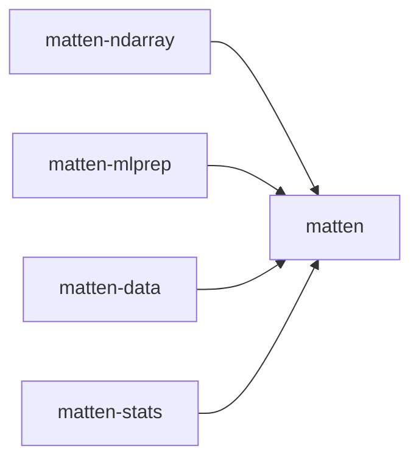

# Architecture

matten is a small core crate plus four independent companion crates. The shape is a
**star, not a stack**: every companion depends on core, and core depends on none of
them.

That shape is enforced from both directions, not just documented:

- **Core depends on no companion.** `crates/matten/Cargo.toml` lists no `matten-*`
  dependency, and `scripts/check-core-dependency-boundary.sh` (RFC-022 §10) fails CI
  if one is ever added — checked with `--all-features`, so an optional dependency
  behind a non-default feature cannot slip past it.
- **No companion depends on another companion** (RFC-078 §6). Each
  `crates/matten-*/Cargo.toml` lists `matten` as its only workspace dependency.

This is the fact worth knowing before choosing what to depend on: pick core alone, or
core plus exactly the companions you need — never a chain.

## The crates

| Crate | For | Maturity |
|---|---|---|
| `matten` | The `Tensor` type: construction, shape ops, arithmetic, reductions, the dynamic (`Element`) on-ramp | stable (v0.x) |
| `matten-ndarray` | Conversion bridge to/from `ndarray::ArrayD<f64>` | production-ready |
| `matten-mlprep` | Small, transparent preprocessing helpers (scaling, bias columns, splits) | production-ready |
| `matten-data` | CSV/table ingestion, reaching `Tensor` via `to_tensor()` | production-ready |
| `matten-stats` | Scalar statistics (covariance, correlation, quantile) | production-ready candidate |

Core's Status is `README.md`'s own label; it sits outside the companion promotion
sequence (RFC-057/080/084/085) tracked in detail in
[Compatibility and stability](./reference/compatibility.md).

## Not part of the published surface

Three local tools and the benchmark harness live in the repository but are
workspace-excluded (`exclude` in the root `Cargo.toml`) and `publish = false`:
`tools/matten-report`, `tools/matten-migrate`, `tools/matten-playground`, and
`benchmarks/`. None of them ship to crates.io, and none can affect the dependency
boundary above — they are excluded from the workspace specifically so their
tool-only dependencies never enter it.

## Feature matrix

Core's Cargo feature matrix (`default`, `serde`, `json`, `csv`, `dynamic`) is listed
once, on the contributor reference page, to avoid two copies drifting apart: see
[Contributing → Architecture](./contributing/architecture.md#cargo-feature-matrix).

## Source layout

This page is the reader's overview. For the module-by-module source layout, public
re-exports, and design invariants, see
[Contributing → Architecture](./contributing/architecture.md).

## The data model

For what a `Tensor` actually holds, how a value moves from raw input to a
computation, and what state a tensor's storage moves through, see
[Data model and lifecycle](./reference/data-model.md).
