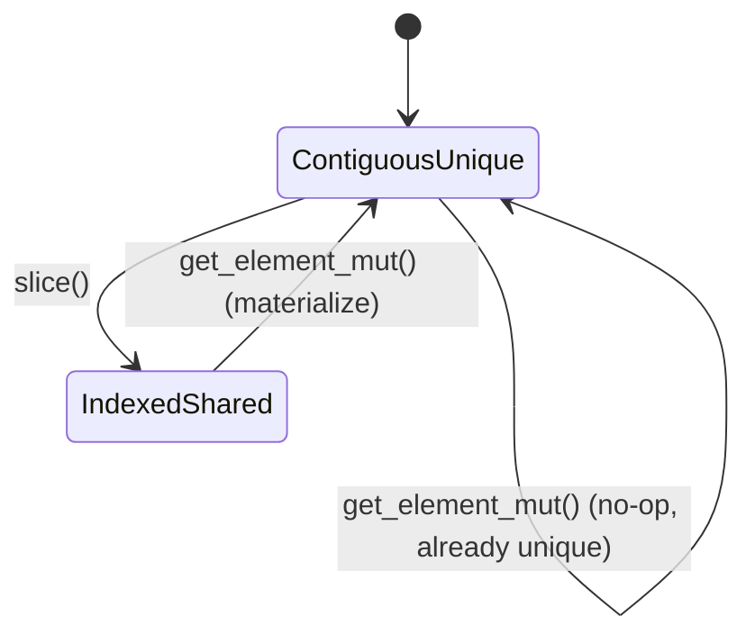

# Data model and lifecycle

## One type, two modes

```text
Tensor {
    data:  Vec<f64>,
    shape: Vec<usize>,
    dynamic: Option<Box<DynamicTensor>>,   // #[cfg(feature = "dynamic")] only
}
```

There is **one** tensor type, with **two** modes. Every `Tensor` is at least a
numeric `Vec<f64>` with a `shape`. With the `dynamic` feature enabled, it can
additionally hold a `DynamicTensor` — heterogeneous, `Element`-typed storage — behind
the same `Tensor` handle.

**The `dynamic` field does not exist without the `dynamic` feature.** On the default
feature set, `Tensor` is exactly the numeric pair (`data`, `shape`); there is no
hidden mode to reach. Everything below that mentions `DynamicTensor`, `Element`, or
`ViewKind` applies only when `dynamic` is enabled.

## The lifecycle

A value's path from raw input to a computed result crosses exactly one gate:

| Stage | What happens | API |
|---|---|---|
| ingest | Read CSV/JSON into heterogeneous storage | `Table` (`matten-data`), or core's `from_csv_dynamic` / `from_json_dynamic` |
| clean | Fill or select values — still dynamic, still `Element`-typed | `fill_none`, selection methods |
| convert | The single gate: numeric-only from here on | `try_numeric()` — fails on any `Text`/`None` element |
| compute | Arithmetic, reductions, matmul — numeric only | the core `Tensor` API |

`try_numeric()` is the one place a heterogeneous value either becomes a plain numeric
`Tensor` or is rejected. Nothing upstream of it is numeric; nothing downstream of it
is anything else.

`Table` (`matten-data`) is a **separate type in a companion crate**, not a `Tensor`
variant and not part of core. It reaches core through
`NumericTable::to_tensor() -> Result<matten::Tensor, _>`.

## The types involved

```text
DynamicTensor { storage: Arc<Vec<Element>>, shape: Vec<usize>, len: usize, view: ViewKind }
ViewKind       Contiguous { offset: usize } | Indexed(Vec<usize>)
Element        Float(f64) | Int(i64) | Text(Arc<str>) | Bool(bool) | None

Table (matten-data) { headers: Vec<String>, rows: Vec<Vec<CellValue>> }
CellValue      Text(String) | Float(f64) | Int(i64) | Bool(bool) | Missing
```

`Table` and `CellValue` are a companion-crate representation for tabular input, not
part of core's `Tensor`/`Element` model — `to_tensor()` is the only bridge between
the two.

## The storage state machine

Dynamic storage is copy-on-write (RFC-012): a tensor either owns its storage
uniquely, or shares it with other tensors via `Arc`, and moves between the two.



Two consequences of this follow directly, and matter independently:

- **A slice retains its source's entire allocation** for as long as the slice
  lives — even after the source tensor is dropped. A one-element slice of a
  100,000-element tensor keeps all 100,000 elements in memory. See
  [Slicing](../reference/slicing.md) (RFC-102 §8.1).
- **Mutating a slice releases that allocation**, as a side effect. The first write
  through `get_element_mut()` materializes a fresh, uniquely-owned copy and detaches
  from whatever the tensor was sharing — an incidental escape hatch from the
  retention cost above, arriving from an unrelated operation. See
  [Dynamic feature](../reference/dynamic.md) (RFC-104 §6.1).
